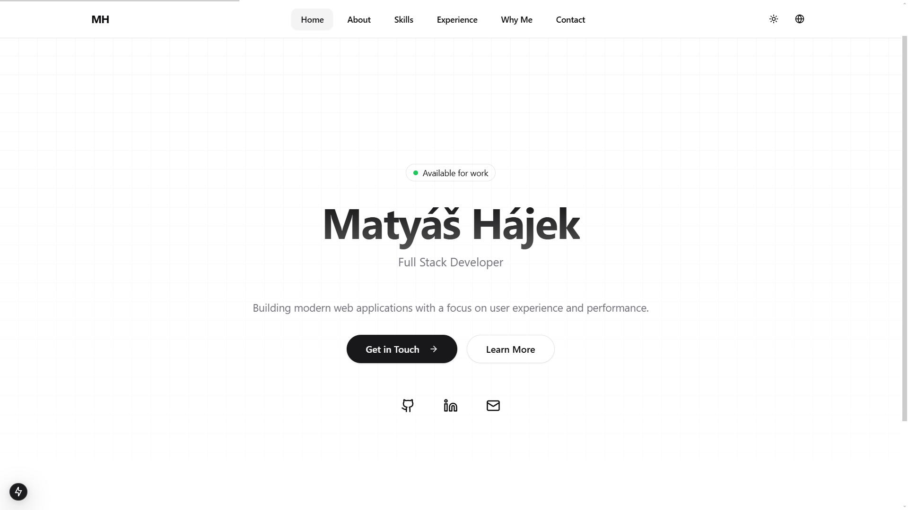

# Matyáš Hájek Portfolio 🚀

[]
[]

A modern, responsive portfolio website built with Next.js, featuring multi-language support, smooth animations, and a clean design.

## ✨ Features

- 🌐 **Internationalization** - Support for English, German, and Czech
- 🎨 **Modern Design** - Clean and professional UI with shadcn/ui components
- 🌓 **Dark Mode** - Automatic and manual theme switching
- ⚡ **Performance** - Server-side rendering and optimized assets
- 📱 **Responsive** - Mobile-first design that works on all devices
- 🔄 **Smooth Transitions** - Page transitions and scroll animations
- 📬 **Contact Form** - Server-side form handling with validation
- 🎯 **SEO Optimized** - Meta tags and semantic HTML

## 🛠️ Tech Stack

- **Framework:** Next.js 13 (App Router)
- **Language:** TypeScript
- **Styling:** Tailwind CSS
- **Components:** shadcn/ui
- **Animations:** Framer Motion
- **Form Handling:** React Hook Form
- **Validation:** Zod
- **Deployment:** Vercel

## 🚀 Getting Started

1. **Clone the repository**
   ```bash
   git clone https://github.com/RedFox-Studios/matyas-hajek.com.git
   cd portfolio
   ```

2. **Install dependencies**
   ```bash
   npm install
   ```

3. **Start the development server**
   ```bash
   npm run dev
   ```

4. **Open your browser**
   Navigate to `http://localhost:3000`

## 🌍 Internationalization

The website supports multiple languages through Next.js's built-in i18n routing:

- 🇺🇸 English (default)
- 🇨🇿 Czech
- 🇩🇪 German

Language files are located in `src/dictionaries/`.

## 📁 Project Structure

```
src/
├── app/                   # Next.js app router pages
├── components/           # React components
│   ├── ui/              # shadcn/ui components
│   └── ...              # Custom components
├── lib/                 # Utility functions
├── hooks/               # Custom React hooks
├── dictionaries/        # Language files
└── styles/             # Global styles
```

## 🎯 Key Components

- **Header** - Navigation and language switching
- **Footer** - Social links and copyright
- **ThemeToggle** - Light/dark mode switching
- **LanguageSwitcher** - Language selection
- **ContactForm** - Form with validation
- **PageTransition** - Smooth page transitions
- **ScrollToTop** - Back to top button

## 📝 Environment Variables

Create a `.env.local` file with:

```env
NEXT_PUBLIC_SITE_URL=your-site-url
```

## 🤝 Contributing

Contributions, issues, and feature requests are welcome!

## 📜 License

This project is licensed under the MIT License - see the [LICENSE](LICENSE) file for details.

## 👤 Author

**Matyáš Hájek**
- GitHub: [@maty7253](https://github.com/maty7253)
- Website: [matyas-hajek.com](https://matyas-hajek.com)

---

<p align="center">Made with ❤️ and a lot of ☕</p>